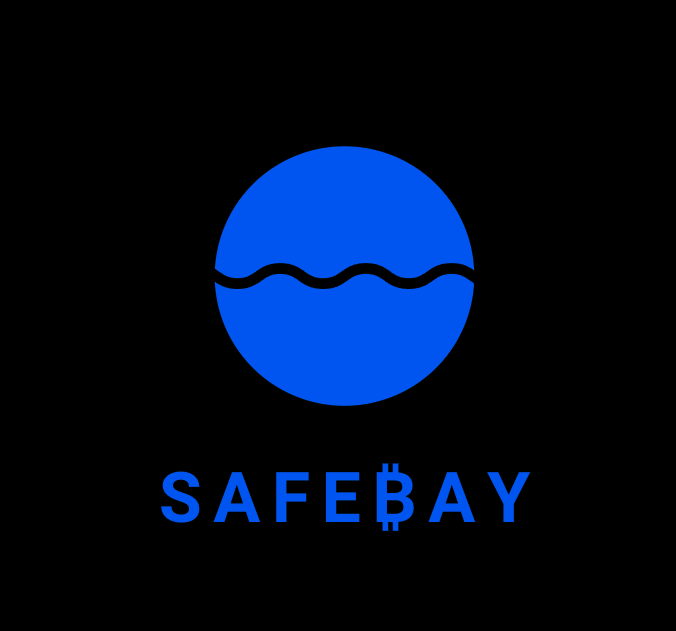
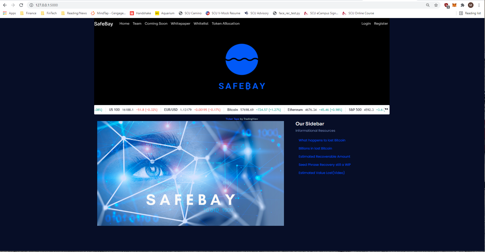
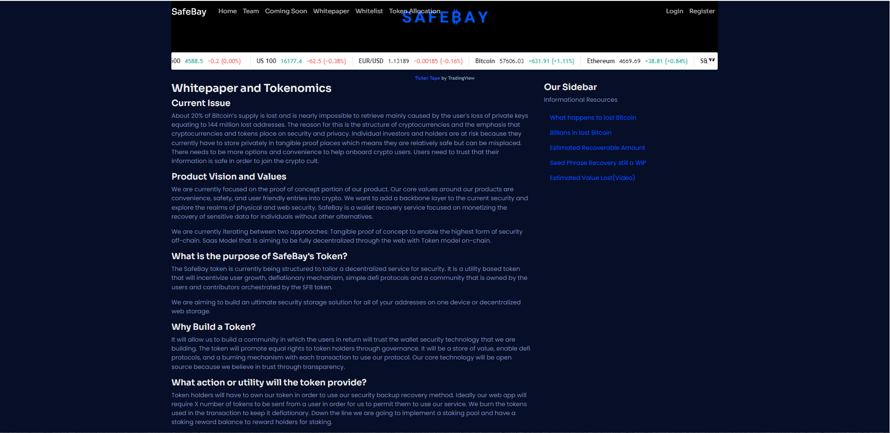
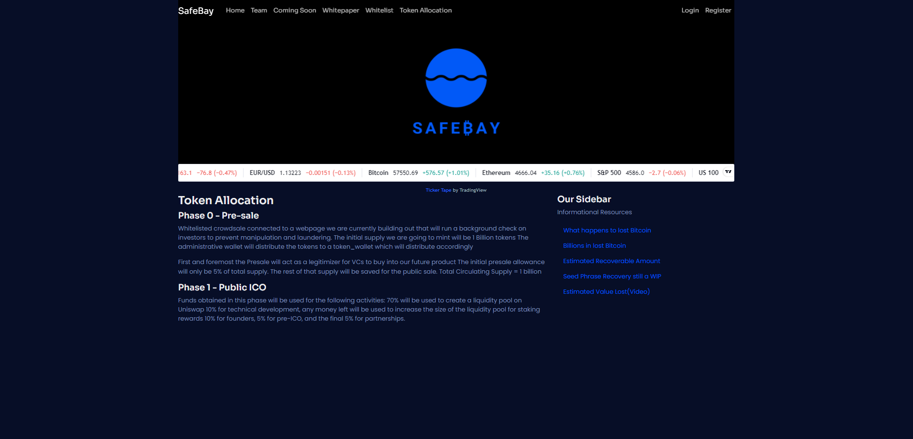
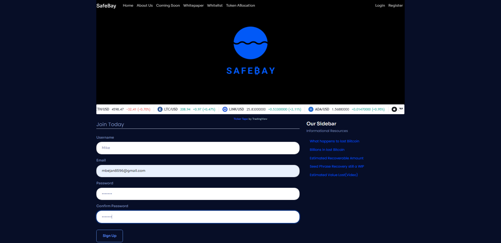
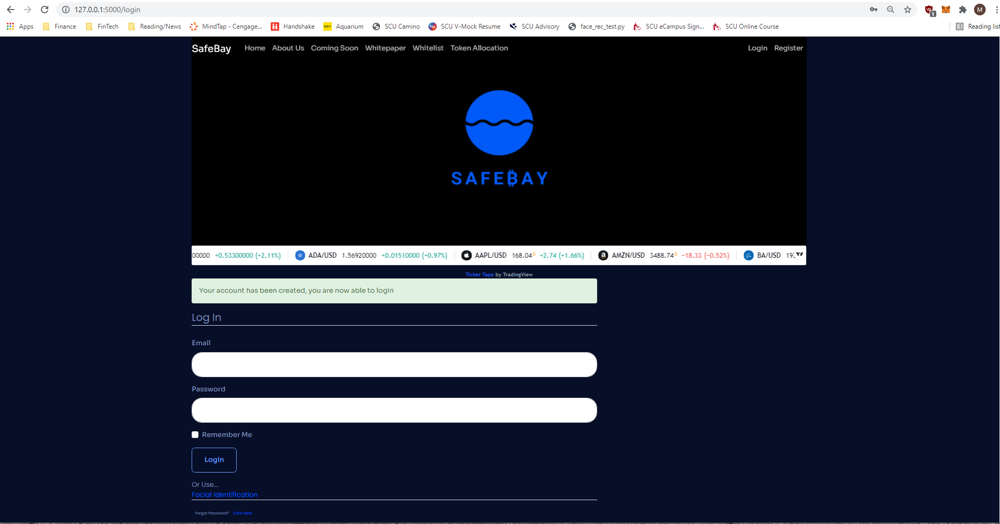
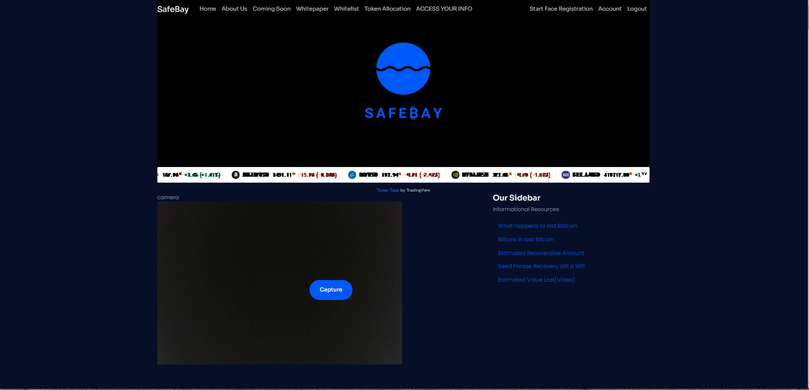
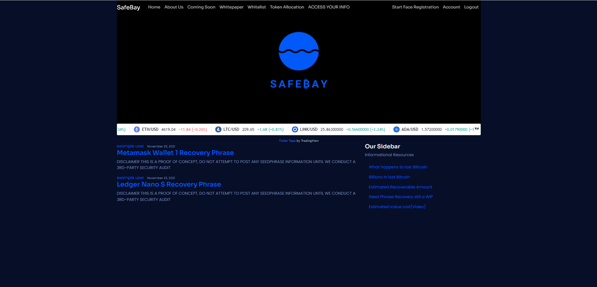

# SafeBayProject

**Welcome!**

This repository contains the files relating to SafeBay. SafeBay, when completed, will offer a final and near failsafe layer of safety and opportunity for wallet recovery due to loss of seed recovery phrases often required in the decentralized finance space. Our motivation for building out this project stems from the projected figures of value lost in cryptocurrency due to lost seed phrases.

For presentation, click [here](https://github.com/rhurst11/SafeBayProject/blob/main/SafeBay_Final_Presentation.pdf)

**Technologies** 

Programming Languages: Python 3.7.10 and Solidity

Development Environments: Ganache and VSCode. 

See 'Final_Requirements.txt' folder for all of the project's required libraries. 

**Installation Guide** 

***Primary SafeBay Site***
for main site, click [here](https://stark-cliffs-51978.herokuapp.com/)

1) Clone the repository
2) Open up your python CLI and create a new environment with the following command: 'conda create -n <name> python=3.7 anaconda -y'.
3) Navigate to the 'SafeBayProject' folder and activate the newly created environment if you have not already.
4) Navigate to the 'fully_integrated_app' folder and run the following command to download all of the projects requirements.
    'pip install -r Final_Requirements.txt'
5) With all of the requirements installed, you can launch our site locally with the following command: 'python run.py'
6) With the site up, users can begin the registration process by inputting some basic information.
7) After registration is complete, new users can sign in to view our whitepaper, token allocation plans, and more.
8) Users also have the option to register their face and use that to log in to our site.
9) See "Webpage Display and Usage" for a site walk-through. 

***SafeBay Whitelisting dApp***
for our whitelist, click [here](https://safebayproject.web.app/)

1) Navigate to the "ICO-whitelisting_dapp" folder then into the "SafeBay_whitelisting" folder and finally into the "ethereum=SafeBay-asset-tokenization" folder. 
2) Ensure that nodejs, solidity compiler, and truffle are installed per the requirements folder. 
3) Navigate to the root directory and run 'npm install', then navigate to the client folder and run 'npm install'
4) Open up Ganache and set up a quick ethereum blockchain and update the 'truffle-config' file with the network parameter if necessary.
5) Compile and migrate smart contracts to the local blockchain with the following code (from truffle console): 'truffle migrate --network "development/ganache-local" --reset'.
6) Start the react app by navigating into the client folder and running the command 'npm start'.
7) If you would like to test the smart contracts, navigate back to the root directory and run the command: 'truffle test'.
    
**Webpage Display and Usage**

SafeBay's home page

Whitepaper and Tokenomics Section

Token Allocation plans

User Registration section

Login Interface

FaceID setup

With FaceID successfully set up, users can add and view their private information. Do not input private information yet, still in development.

The webstyling for our site was developed in VSCode using HTML, CSS, Bootstrap 5, and part of the color scheme and code for Safia, a free responsive 5 HTML5 multipurpose landing page. All photo stock used at the website came from Adobe Stock. The presentation was built in Canva using Canva and Adobe stock images. Our logo was designed in Canva.

**Contributors**

Project Manager/Founder: Ray Hurst

Backend/Frontend Developer: Michael Bejan

Solidity/Tokenomics Developer: Leo Harada

Front End Manager/Brand Ambassador: Tonia Hurst

Head of Research/Solidity Developer: Nathan Duft

**License**

Private project, no license for public use.
